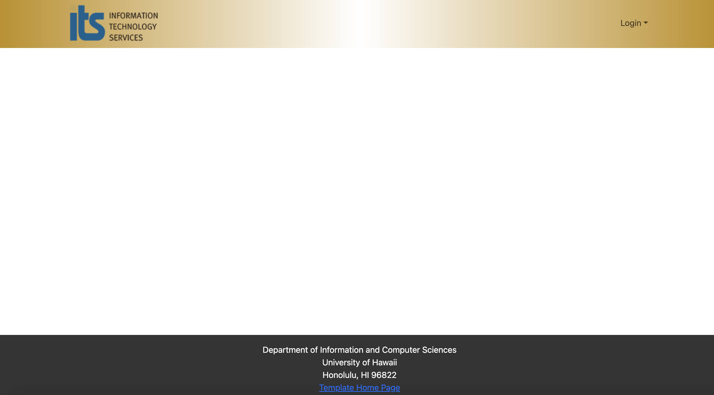

This is a Meteor 2.9 application that illustrates: 

  * A standard directory layout using 'imports/' as recommended in the [Meteor Guide](https://guide.meteor.com/structure.html)
  * [Bootstrap 5 React](https://react-bootstrap.github.io/) for user interface.
  * [Uniforms](https://uniforms.tools/) for form development.
  * [alanning:roles](https://github.com/alanning/meteor-roles) to implement a special "Admin" user.
  * Authorization, authentication, and registration using built-in Meteor packages.
  * Initialization of users and data from a settings file.
  * Alerts regarding success or failure of DB updates using [Sweet Alert](https://sweetalert.js.org/).
  * Quality assurance using [ESLint](http://eslint.org) with packages to partially enforce the [Meteor Coding Standards](https://guide.meteor.com/code-style.html) and the [AirBnB Javascript Style Guide](https://github.com/airbnb/javascript).

The goal of this template is to help you get quickly started doing Meteor development by providing a reasonable directory structure for development and deployment, a set of common extensions to the core framework, and boilerplate code to implement basic page display, navigation, forms, roles, and collection manipulation.

To keep this codebase simple and small, some important capabilities are intentionally excluded from this template:

  * Unit Testing.
  * Security (meteor-application-template-react enables the insecure packages)
  * Deployment

Examples of the these capabilities will be provided elsewhere.

## Installation

First, [install Meteor](https://www.meteor.com/install).

Second, go to [https://github.com/ics-software-engineering/meteor-application-template-react](https://github.com/ics-software-engineering/meteor-application-template-react), and click the "Use this template" button. Complete the dialog box to create a new repository that you own that is initialized with this template's files.

Third, go to your newly created repository, and click the "Clone or download" button to download your new GitHub repo to your local file system.  Using [GitHub Desktop](https://desktop.github.com/) is a great choice if you use MacOS or Windows.

Fourth, cd into the app/ directory of your local copy of the repo, and install third party libraries with:

```
$ meteor npm install
```

## Running the system

Once the libraries are installed, you can run the application by invoking the "start" script in the [package.json file](https://github.com/ics-software-engineering/meteor-application-template-react/blob/master/app/package.json):

```
$ meteor npm run start
```

The first time you run the app, it will create some default users and data. Here is the output:

```
 meteor npm run start 

> meteor-application-template-react@ start /Users/blues/Documents/GitHub/uh-askus-ai/app
> meteor --no-release-check --exclude-archs web.browser.legacy,web.cordova --settings ../config/settings.development.json

[[[[[ ~/Documents/GitHub/uh-askus-ai/app ]]]]]     

=> Started proxy.                             
=> Started HMR server.                        
=> Started MongoDB.                           
I20231104-20:34:33.148(-10)? Creating the default user(s)
I20231104-20:34:33.154(-10)?   Creating user admin@foo.com.
I20231104-20:34:33.805(-10)?   Creating user john@foo.com.

=> Started your app.

=> App running at: http://localhost:3000/
```

Periodically, you might see `Error starting Mongo (2 tries left): Cannot run replSetReconfig because the node is currently updating its configuration` after the `=> Started HMR server.`. It doesn't seem to be a problem since the MongoDB does start.

### Viewing the running app

If all goes well, the template application will appear at [http://localhost:3000](http://localhost:3000).  You can login using the credentials in [settings.development.json](https://github.com/ics-software-engineering/meteor-application-template-react/blob/main/config/settings.development.json), or else register a new account.

### ESLint

You can verify that the code obeys our coding standards by running ESLint over the code in the imports/ directory with:

```
meteor npm run lint
```

## Walkthrough

The following sections describe the major features of this template.

### Directory structure

The top-level directory structure is:

```
.github     # holds the GitHub Continuous Integration action and Issue template.
app/        # holds the Meteor application sources
config/     # holds configuration files, such as settings.development.json
doc/        # holds developer documentation, user guides, etc.
.gitignore  # don't commit IntelliJ project files, node_modules, and settings.production.json
```

### Import conventions

This system adheres to the Meteor guideline of putting all application code in the imports/ directory, and using client/main.js and server/main.js to import the code appropriate for the client and server in an appropriate order.

#### Landing page

When you retrieve the app at http://localhost:3000, this is what should be displayed:



### CSS

The application uses the [React implementation of Bootstrap 5](https://react-bootstrap.github.io/). You can adjust the theme by editing the `app/client/style.css` file. To change the theme override the Bootstrap 5 CSS variables.

```css
/* Change bootstrap variable values.
 See https://getbootstrap.com/docs/5.2/customize/css-variables/
 */
body {
  --bs-light-rgb: 236, 236, 236;
}

/* Define custom styles */
.gray-background {
  background-color: var(--bs-gray-200);
  color: var(--bs-dark);
  padding-top: 10px;
  padding-bottom: 20px;
}
```

### Routing

For display and navigation among its four pages, the application uses [React Router](https://reacttraining.com/react-router/).

Routing is defined in [imports/ui/layouts/App.jsx](https://github.com/ics-software-engineering/meteor-application-template-react/blob/main/app/imports/ui/layouts/App.jsx).


### Authentication

For authentication, the application uses the Meteor accounts package.

When the application is run for the first time, a settings file (such as [config/settings.development.json](https://github.com/ics-software-engineering/meteor-application-template-react/blob/main/config/settings.development.json)) should be passed to Meteor. That will lead to a default account being created through the code in [imports/startup/server/accounts.js](https://github.com/ics-software-engineering/meteor-application-template-react/blob/main/app/imports/startup/server/accounts.js).

The application allows users to register and create new accounts at any time.

### Authorization

Only logged in users can manipulate Stuff documents (but any registered user can manipulate any Stuff document, even if they weren't the user that created it.)

### Configuration

The [config](https://github.com/ics-software-engineering/meteor-application-template-react/blob/main/config) directory is intended to hold settings files.  The repository contains one file: [config/settings.development.json](https://github.com/ics-software-engineering/meteor-application-template-react/blob/main/config/settings.development.json).

The [.gitignore](https://github.com/ics-software-engineering/meteor-application-template-react/blob/main/.gitignore) file prevents a file named settings.production.json from being committed to the repository. So, if you are deploying the application, you can put settings in a file named settings.production.json and it will not be committed.

### Development History

### Quality Assurance

#### ESLint

The application includes a [.eslintrc](https://github.com/ics-software-engineering/meteor-application-template-react/blob/main/app/.eslintrc) file to define the coding style adhered to in this application. You can invoke ESLint from the command line as follows:

```
[~/meteor-application-template-react/app]-> meteor npm run lint

> meteor-application-template-react@ lint /Users/philipjohnson/meteor-application-template-react/app
> eslint --quiet ./imports
```

ESLint should run without generating any errors.

It's significantly easier to do development with ESLint integrated directly into your IDE (such as IntelliJ).

### Team Members

This application is designed, implemented, and maintained by [James Ligeralde](https://https://jligeral.github.io/), [Frances Michelle Uy](https://https://frances-uy.github.io/), [Jonathan Sapolu](https://https://jsapolu99.github.io/) and [Michelle Ho](https://https://michho8.github.io/).